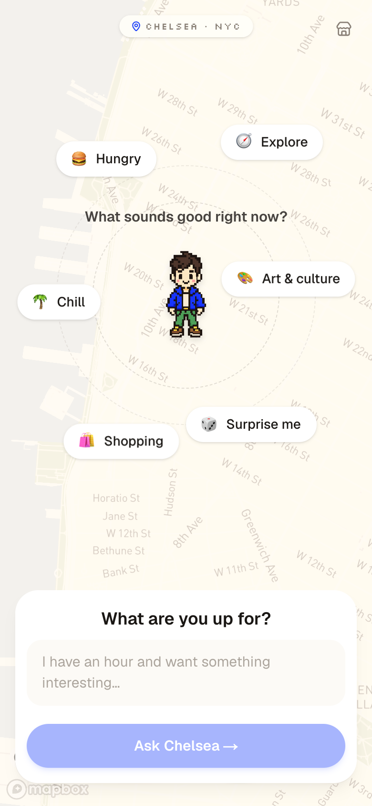
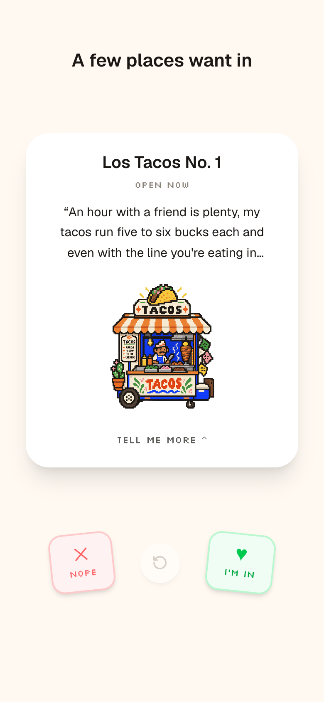
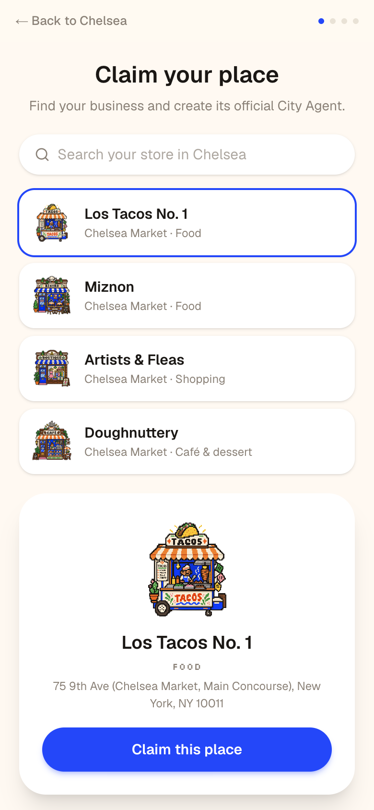

# City Agent

**The city comes to you.**

Tell the city what you feel like doing, and real nearby places wake up as AI
characters: they pitch themselves, debate each other at a roundtable, back
their claims with real evidence (menus, prices, hours, current shows), and
help you pick — all on a cozy pixel-art stage.

**🌆 Try it: [city-agents-lime.vercel.app](https://city-agents-lime.vercel.app)**

> Best on a phone. For the full app feel: open in Safari → Share →
> **Add to Home Screen** → launch from the icon (runs full-screen, no browser chrome).

| Tell it what you want | Places pitch you directly | Businesses teach their agent |
|:---:|:---:|:---:|
|  |  |  |

## The experience

1. **Call the city** — pick emoji pills orbiting your character (adaptive:
   choosing "Hungry" swaps in a food-specific follow-up) or just type.
2. **The city wakes up** — radar sweeps, storefronts gather, the neighborhood
   hears you.
3. **Swipe to decide** — each candidate pitches you on a card, in its own
   voice. Right keeps it, left passes, undo if you change your mind.
4. **The roundtable** — your keeps introduce themselves and debate. Ask
   anything; they answer honestly, play evidence cards with real photos, and
   concede when a rival is genuinely better for you.
5. **Here we go** — confetti, the winner's closing line, walking directions,
   and curated know-before-you-go cards.

### Store Mode (for businesses)

A one-minute merchant flow (storefront icon, top right): **claim your place →
teach your agent** (best-for tags, not-ideal-for tags, personality) **→ add
highlights → preview**. The taught configuration persists and genuinely
changes what the consumer agents say and how the place ranks — the business
controls how its agent represents it, while City Agent decides whether it's
actually relevant to the user.

## What's real

- **22 real Chelsea places** with curated data: menu prices, hours, review
  sentiments, current exhibitions. Every evidence card carries a source URL
  and verification date (`src/data/places/`).
- **Real AI agents** — Claude (claude-sonnet-5) parses intent, picks 3
  deliberately different candidates, writes each pitch in the place's own
  voice, and runs the roundtable in a single call so agents can respond to
  each other and concede honestly.
- **Anti-hallucination by construction** — agents only see fact sheets
  serialized from the dataset; evidence citations are validated server-side,
  so the UI can never render an invented proof card. Distances and prices
  are computed from data, never from model text.
- **Real photos** via Google Places, proxied server-side (key never reaches
  the browser).
- **Real map + geolocation** — Mapbox GL with warm-styled streets; falls
  back to Chelsea Market when you're elsewhere.

## Built to expand beyond Chelsea

Places are tagged with a neighborhood id, and everything else derives from a
single registry (`src/data/neighborhoods.ts`): map camera, UI copy ("Ask
Chelsea", "Chelsea wakes up"), agent prompts, and API candidate scoping all
read from the user's nearest neighborhood. **Adding a new area = one registry
entry + tagged places. No code changes.**

## Source code

The application source lives in a private repository — this public page is
the project overview. Read access for judging or evaluation is available on
request.

## Architecture

Single-page phase machine (`call → waking → meet → roundtable → narrow →
decision`, plus Store Mode) over a persistent Mapbox canvas. Server routes
keep API keys server-side and stream agent output as SSE with incremental
JSON parsing, so pitches and debate turns appear the moment each completes.

- `src/app/api/intent` — free text + selected pills → structured intent
- `src/app/api/pitches` — neighborhood scoping + deterministic pre-scoring →
  Claude picks 3 different candidates + writes pitches (streamed)
- `src/app/api/roundtable` — one call, all agents' turns, debate or
  final-pitch mode (streamed)
- `src/app/api/photo/[placeId]` — Google Places photos, proxied + cached
- `src/app/api/enrich/[placeId]` — live open-now status (30-min cache)
- `src/lib/merchant-override.ts` — Store Mode config merged into places at
  the data boundary (affects ranking, prompts, chips, and demo fallbacks)
- `src/lib/ratelimit.ts` — per-IP + global budgets; over-limit traffic
  silently degrades to scripted demo mode instead of erroring
- `src/data/neighborhoods.ts` — the expansion registry
- `src/data/places/*` — the curated dataset

Every layer degrades gracefully when a key is missing or a budget is hit —
the demo never hard-crashes.

## License

**All rights reserved.** This repository is public for evaluation and
demonstration purposes only — no reuse, redistribution, or derivative works
are permitted. See [LICENSE](LICENSE).
