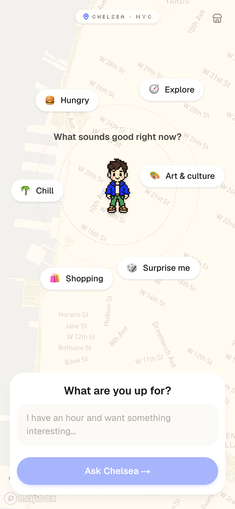
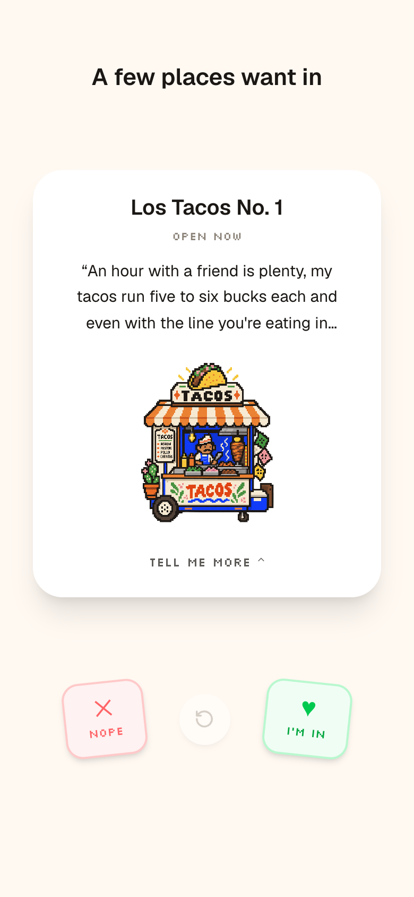
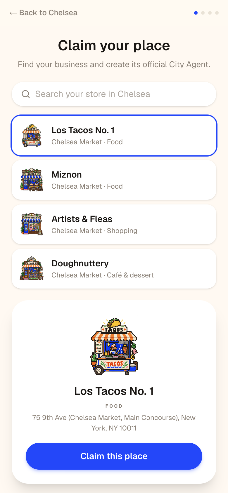

# City Agent

**The city comes to you.**

Tell the city what you feel like doing, and real nearby places wake up as AI
characters: they pitch themselves, debate each other at a roundtable, back
their claims with real evidence (menus, prices, hours, current shows), and
help you pick — all on a cozy pixel-art stage.

**🌆 Try it: [city-agents-lime.vercel.app](https://city-agents-lime.vercel.app)**

> Best on a phone. For the full app feel: open in Safari → Share →
> **Add to Home Screen** → launch from the icon (runs full-screen, no browser chrome).

| Tell it what you want | Places pitch you directly | Businesses teach their agent |
|:---:|:---:|:---:|
|  |  |  |

## The experience

1. **Meet Doti** — a pixel dachshund city companion walks first-time users
   through the flow (once, skippable).
2. **Call the city** — pick emoji pills orbiting Doti (adaptive: choosing
   "Hungry" swaps in a food-specific follow-up) or just type what you feel
   like: *"coffee and somewhere to sit"*, *"drinks with friends tonight"*.
3. **The city wakes up** — radar sweeps and real places within a ~25-minute
   walk of *you* light up, whichever neighborhood they happen to sit in.
4. **Swipe to decide** — each candidate pitches you on a card, in its own
   voice. Right keeps it, left passes, undo if you change your mind, or ask
   for another round of picks.
5. **The roundtable** — your keeps introduce themselves and debate in one
   live conversation. Ask anything; they answer honestly, play evidence cards
   (menu prices, receipts, reviews, photos, current shows) and concede when a
   rival is genuinely better for you. Down to two, they go head to head.
6. **Here we go** — confetti, the winner's closing line, walking directions,
   and know-before-you-go cards.

The result: instead of scrolling pins and star ratings, you get a short,
opinionated conversation between genuinely different options that argue
with real, sourced facts, and end with one confident choice and a route.

### Store Mode (for businesses)

A one-minute merchant flow (storefront icon, top right): **claim your place →
teach your agent** (best-for tags, not-ideal-for tags, personality) **→ add
highlights → preview**. The taught configuration persists and genuinely
changes what the consumer agents say and how the place ranks — the business
controls how its agent represents it, while City Agent decides whether it's
actually relevant to the user.

## What's real

- **All five boroughs, 2,300+ published places** (September 2026). Chelsea is
  the hand-curated flagship (22 places researched by hand, plus ~120 drafted
  and human-reviewed); everywhere else in NYC is built on demand from
  OpenStreetMap and each venue's own website.
- **A catalog that grows with use** — a search on an unfamiliar block sweeps
  it for places, drafts profiles for what you asked for, and every later
  visitor gets them instantly. A nightly cron keeps busy cells warm.
- **Quality gates** — every discovered place is checked against Google Places
  so closed businesses (which OSM keeps for years) are archived, errands like
  pharmacies and copy shops are kept out, and appointment-only venues are not
  pitched for walk-ins.
- **8 categories** — food, bars, coffee & dessert, shops, galleries, outdoors,
  activities and oddities.
- **Real AI agents** — Claude (claude-sonnet-5) parses intent, picks up to 8
  deliberately different candidates, writes each pitch in the place's own
  voice, and runs the roundtable in a single call so agents can respond to
  each other and concede honestly.
- **Anti-hallucination by construction** — agents only see fact sheets
  serialized from the dataset; evidence citations are validated server-side,
  so the UI can never render an invented proof card. Distances and prices
  are computed from data, never from model text. Every evidence card carries
  a source URL and verification date.
- **Real photos and open-now status** via Google Places, proxied server-side
  (the key never reaches the browser).
- **Real map + geolocation** — Mapbox GL with warm-styled streets. Outside
  NYC, the app says so honestly and shows Chelsea.
- **Beta control room** (`/admin`) — browse and export the catalog, review
  places automated checks couldn't confirm, and watch usage stats.

## Areas: curated hoods and the open world

Search is by distance from the person, not by neighborhood. Curated
neighborhoods (`src/data/neighborhoods.ts`) add hand-researched places and
editorial framing (map camera, "Ask Chelsea" copy, claim boundaries);
everywhere else in NYC resolves to a ~1km cell named by reverse geocoding.
**Adding a curated area = one registry entry + tagged places. No code
changes.**

## Source code

The application source lives in a private repository — this public page is
the project overview. Read access for judging or evaluation is available on
request.

## Architecture

Single-page phase machine (`call → waking → meet → roundtable → narrow →
decision`, plus Store Mode) over a persistent Mapbox canvas. Server routes
keep API keys server-side and stream agent output as SSE with incremental
JSON parsing, so pitches and debate turns appear the moment each completes.

- `src/app/api/intent` — free text + selected pills → structured intent
- `src/app/api/pitches` — places within walking distance of the user +
  deterministic pre-scoring → Claude picks up to 8 different candidates and
  writes pitches (streamed)
- `src/app/api/roundtable` — one call, all agents' turns, debate or
  final-pitch mode (streamed)
- `src/app/api/area` — curated hood or open-world cell for a location
- `src/app/api/warmup`, `src/app/api/cron/warm-cells` — on-demand and nightly
  discovery + drafting (`src/lib/discover.ts`, `draft-place.ts`,
  `validate-place.ts`, `enrich-mode.ts`)
- `src/app/api/photo/[placeId]` — Google Places photos, proxied + cached
- `src/app/api/enrich/[placeId]` — live open-now status (30-min cache)
- `src/app/api/merchant` — Store Mode; `src/lib/merchant-override.ts` merges
  the config into places at the data boundary (ranking, prompts, chips, demo
  fallbacks)
- `src/app/api/admin` — catalog, review queue and stats for `/admin`
- `src/lib/ratelimit.ts` — per-IP + global budgets; over-limit traffic
  silently degrades to scripted demo mode instead of erroring
- `src/data/neighborhoods.ts` — the curated-area registry
- `src/data/places/*` — the hand-curated dataset (seeded into Supabase)

Every layer degrades gracefully when a key is missing or a budget is hit —
the demo never hard-crashes.

## Data attribution

Place data outside the curated set is derived in part from
[OpenStreetMap](https://www.openstreetmap.org/copyright) contributors,
available under the Open Database License (ODbL).

## License

**All rights reserved.** This repository is public for evaluation and
demonstration purposes only — no reuse, redistribution, or derivative works
are permitted. See [LICENSE](LICENSE).
